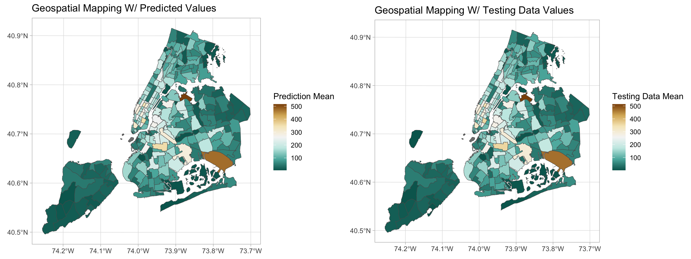
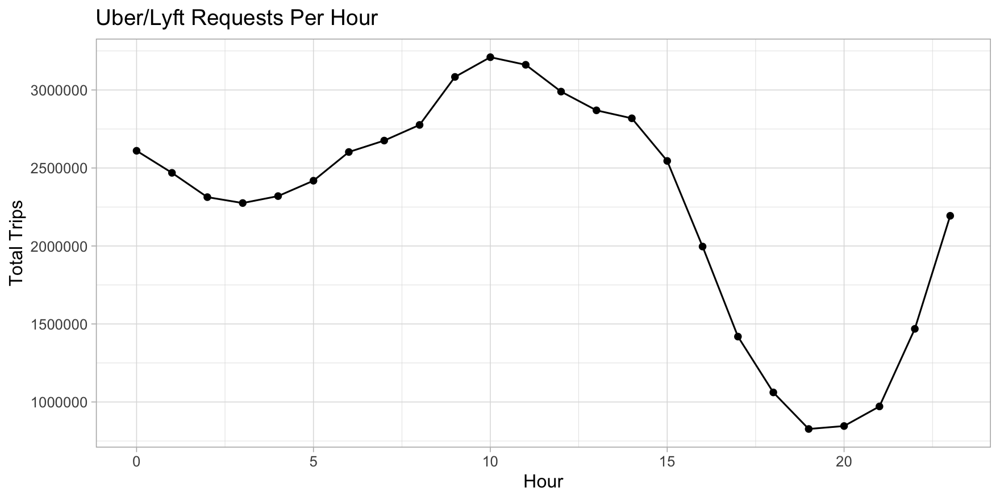
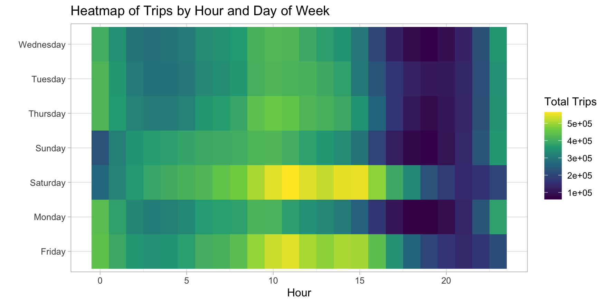
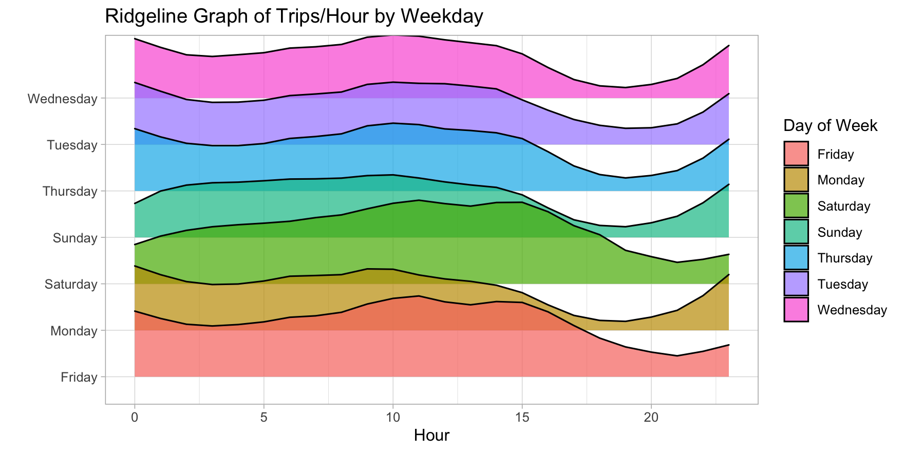
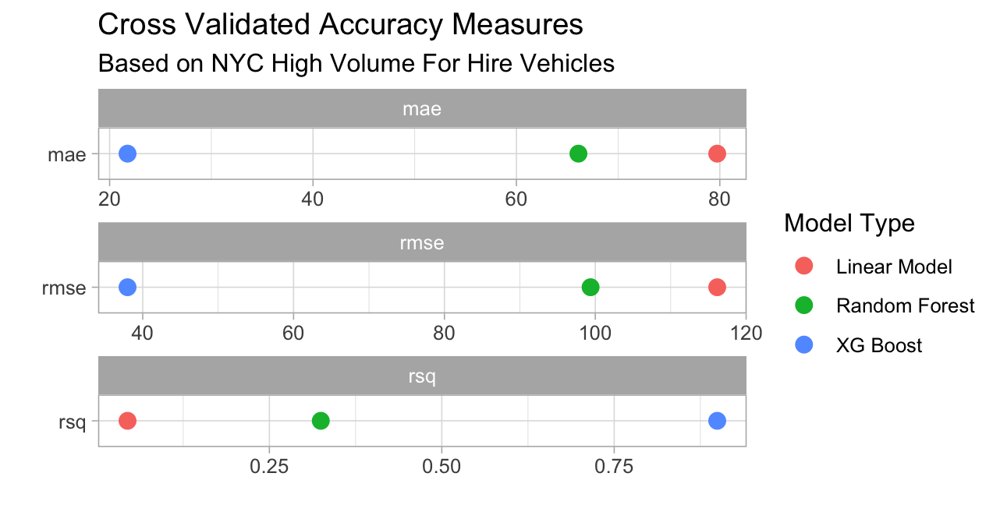
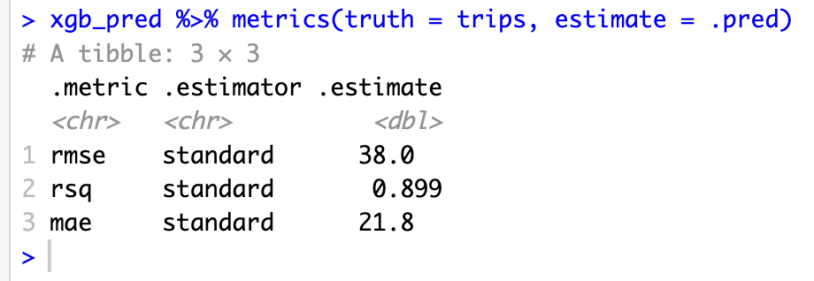

# NYC Taxi and Ride Data Analysis

This project analyzes New York City for hire vehicles (Uber and Lyft) to explore patterns in ride demand, distributions in trips, and geospatial trends. It includes data scraping, processing, visualization, and predictive modeling to gain insight on how factors such as weather, day, time, etc. affect the usage of for hire vehicle services.




---

## Features

- **Data Processing**: Clean, merge, and aggregate NYC taxi and ride-hailing datasets (yellow, green taxis, and FHVs).  
- **Exploratory Data Analysis**: Analyze trip counts, hourly/daily trends, and ride distribution by location.  
- **Geospatial Mapping**: Visualize trip intensity across NYC boroughs and taxi zones using `sf` and `ggplot2`.  
- **Predictive Modeling**: Train and evaluate models (linear regression, random forest, and xg boost) to predict trip counts based on time, location, and weather.  
- **Cross-Validation & Model Comparison**: Compare performance metrics (RMSE, R², MAE) for different models.  

---

## Data

- **Raw Data**: NYC taxi trip data and FHV (For-Hire Vehicle) data in CSV or Parquet format.  
- **Taxi Zones**: Shapefiles (`taxi_zones.shp`) used for geospatial mapping.  
- **Weather Data**: Optional weather data for predictive modeling.

> Note: Large files will need to be downloaded separately due to GitHub file size limits.

Provided below is information on how to download any extra data files. Since this project used over 70 million data entries in order to do predictive modeling, csv and parquet files that were used for this project were too large to upload or push into github.

NYC FHVHV Data: https://www.nyc.gov/site/tlc/about/tlc-trip-record-data.page

I used data from Novermber 2024 - January 2025

This data should be put into a folder called "raw" in the data folder with the names as follows:

- fhvhv_tripdata_2024-11.parquet
- fhvhv_tripdata_2024-12.parquet
- fhvhv_tripdata_2025-01.parquet

Processed Data:
In the processed folder, there are three R files that use the write_csv function at the bottom of each. Open these files in RStudio and run these functions, saving the csv files into the processed folder with the subsequent R files.

---
## Project Findings

New York City high volume for hire vehicle have pick up locations based on location IDs throughout NYC. I used these pickup locations to ultimately do geospatial visualization. I used data over the period of November 1st, 2024 to January 20th, 2025 to base my project on.

After processing my data such that for every hour at each location ID there was a calculated total_trips amount, I linked this data to weather data and holidays. This means for any given time and location, the data also provided what the weather was like and if that day landed on a holiday.

Initially, I did exploratory visualization with this data. Below include the total number of trips per hour throughout the timeframe, a heat map popular times to travel throughout the day, and a ridgeline graph using the ggridges package that gave a better visualization of the popular travel times during a given day.









I then used did predictive modeling using cross validation on my data. I training and testing splits (80/20 split) and ran a linear model, random forest, and eXtreme Gradient Boosting (xgboost). I then got their respective metrics to determine the overall effectiveness of each model.





By far the xgboost model was the most effective (as seen in the graph above), with an rsq of around 0.9, rmse of 38, and mae of 21.8. This data shows that about 90% of the variation in the data is explained by my xgboost model, which is very effective considering the sheer amount of data that was used (over 70 million entry points). 





I used my XGBoost model to generate predictions for the mean number of trips per day in New York City and created a geospatial visualization comparing these predicted values with the actual mean trips from the testing data. As shown in the two maps below, the predicted and actual values are very similar. Further analysis revealed that, on average, the model’s predicted mean trips per location per day were only 0.62 trips off from the actual values, which demonstrates high accuracy. Overall, the XGBoost model was highly effective in predicting for-hire vehicle usage in New York City. This predictive modeling approach also highlights how factors such as weather conditions, holidays, and date and time can influence for-hire vehicle demand, making it a strong example of applied data science in transportation.


---
## Installation

1. Clone the repository:

```bash
git clone https://github.com/yourusername/nyc-taxi-analysis.git
cd nyc-taxi-analysis
