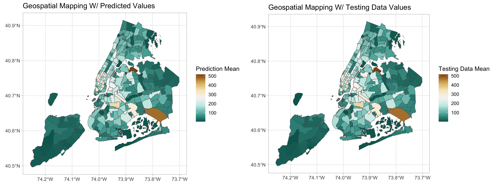
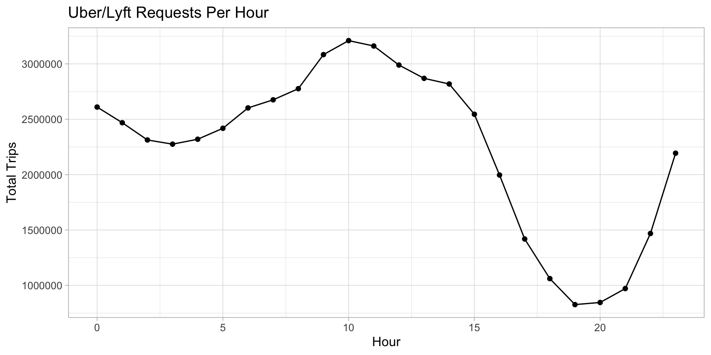
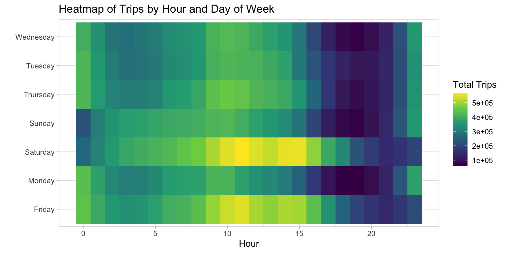
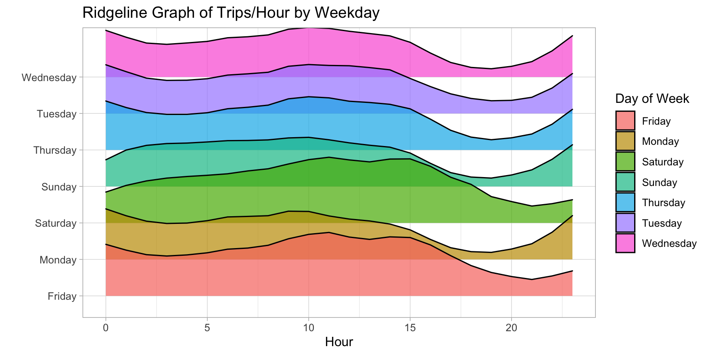
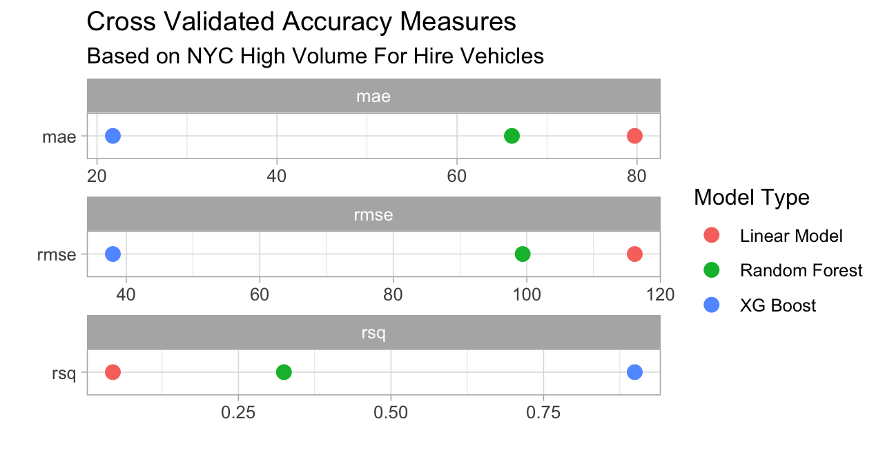
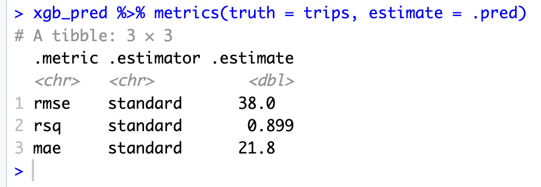

# NYC Ride Demand Forecasting

## Introduction
This project uses R and the Tidymodels package to forecast ride demand in New York City using For-Hire Vehicle (FHVHV) trip data. By combining historical ride data with external factors like weather, the goal is to better understand demand patterns and build predictive models that can inform business decisions for ride-sharing platforms.

---

## Project Details
- **Dataset:** FHV trip data from NYC Open Data (`fhvhv_tripdata_YYYY-MM.parquet`), Weather data fom NCEI  
- **Objective:** Predict hourly demand for FHV services in NYC
- **Tech Stack:**  
  - R for data cleaning and analysis  
  - Tidymodels for predictive modeling to forecast data
---

## Project Workflow

### 1. Data Collection & Cleaning
- Collected NYC FHVHV trip data from **November 2024 to January 2025**
- Cleaned and preprocessed the dataset:
  - Removed duplicated, missing, and inconsistent values for hourly rides
  - Standardized timestamps and location fields
  - Rounded times down by the hour for better data visualization

---

### 2. Feature Engineering & Data Integration
- Merged ride data with **weather data** by inner joining time to capture external influences on demand  
- Created additional features such as:
  - Hour of day  
  - Day of week  
  - Weather conditions (temperature, precipitation, etc.)

---

### 3. Exploratory Data Analysis (EDA)

#### Ride Trends Over Time

- Clear temporal patterns in ride demand
- Peaks during commute hours (mid-day) and late-night activit

#### Heatmap of Demand

- Demand varies significantly by time and location
- Highlights opportunities for dynamic pricing and supply allocation

#### Ridgeline Analysis

- Compared ride distributions across different time periods  
- Key insight:
  - **Nighttime rides shows a surprising amount of demand, likely from returning home from bars, clubs, etc.**  
  - Suggests Uber and Lyft could benefit from **increased driver incentives during late hours**

---

## 4. Predictive Modeling

Used the **tidymodels** framework in R to build and evaluate multiple models:

- Linear Regression  
- Random Forest  
- XGBoost

#### Cross-Validation Accuracy

#### XGBoost Performance

- Achieved approximately **0.90 R²**, indicating strong predictive performance  
- XGBoost performed best overall, capturing nonlinear relationships in the data  

#### Geospatial Patterns
Using my XGBoost model, I created a geospatial map of New York City to compare true values of average rides per NYC zone to the model's predicted values, and it resulted in geospatial maps that were nearly identical!

---

## Key Takeaways

- Ride demand is highly **time-dependent**, with strong hourly and daily patterns  
- **Weather plays a meaningful role** in influencing ride volume  
- **Nighttime demand is under-optimized**, presenting an opportunity for pricing and incentive strategies  
- Machine learning models, especially **XGBoost**, can effectively forecast ride demand with high accuracy  
- Insights from this project can help ride-sharing platforms:
  - Optimize driver allocation  
  - Improve surge pricing strategies  
  - Enhance customer experience through better availability  

---

## Future Improvements

- Incorporate real-time data streams  
- Expand dataset across a longer time horizon  
- Include additional external factors (events, holidays, transit data)  
- Deploy as a live dashboard or API for real-time predictions  
